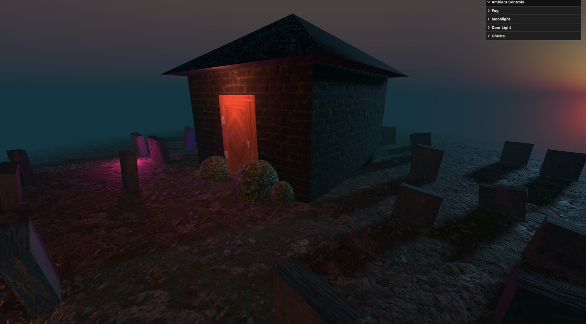

# Haunted House

A real-time 3D scene built with Three.js: a house in a foggy graveyard at dusk, lit by moonlight and haunted by three floating spirits.



## What it demonstrates

**PBR materials.** Every surface uses a full physically based texture set — colour, normal, and a packed ARM map (ambient occlusion, roughness, metalness in a single file's RGB channels). The floor and door also use displacement maps to add real geometric relief instead of faking it with normals alone.

**Procedural atmosphere.** The sky is generated at runtime by the Preetham analytic daylight model, with the sun parked just below the horizon to produce twilight. Exponential fog tinted to match dissolves the horizon, and an alpha map fades the floor plane's edges so the ground has no visible boundary.

**Dynamic lighting and shadows.** Four shadow-casting lights: a directional moonlight and three orbiting point lights, each following a stacked-sine path that never visibly repeats. Shadow cameras and map sizes are tuned per light to keep the cost down.

**Real-time controls.** A lil-gui panel exposes fog, moonlight, door light, and ghost parameters. Colours are stored as hex strings and applied with `Color.set()`, so the picker matches what is rendered — Three.js keeps colour channels in linear space, which makes the naive binding show the wrong value.

## Built with

- [Three.js](https://threejs.org/) r174
- [Vite](https://vite.dev/) 6
- [lil-gui](https://lil-gui.georgealways.com/)

## Running locally

Requires [Node.js](https://nodejs.org/) 18 or newer.

```bash
npm install     # install dependencies
npm run dev     # start the dev server at localhost:5173
npm run build   # build for production into dist/
```

## Credits

Built following lesson 16 of [Three.js Journey](https://threejs-journey.com/) by Bruno Simon, with additional work on the debug panel.

Textures from [Poly Haven](https://polyhaven.com/) (CC0).
